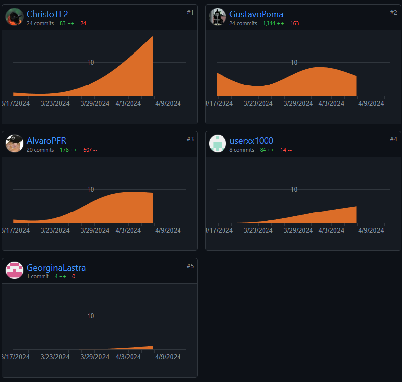
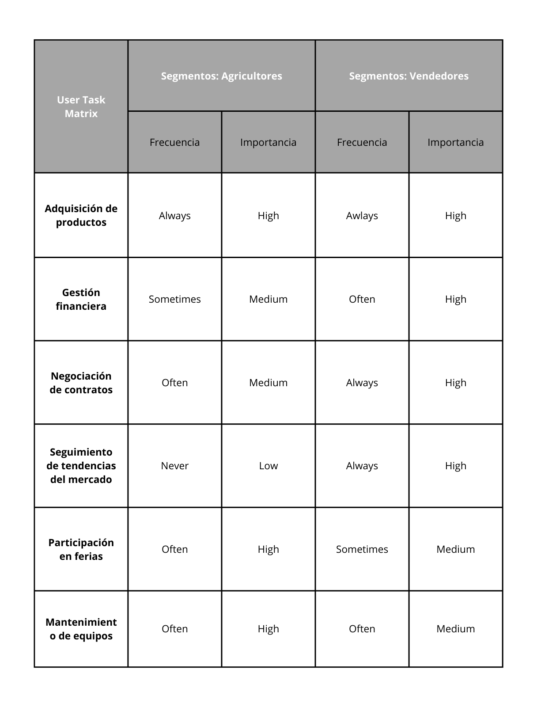
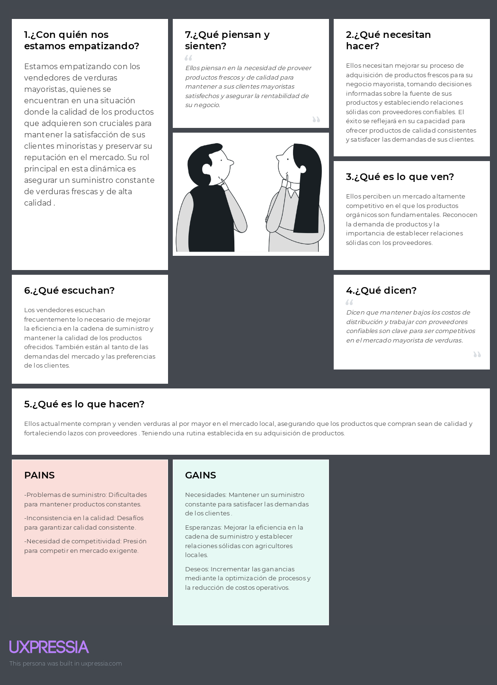
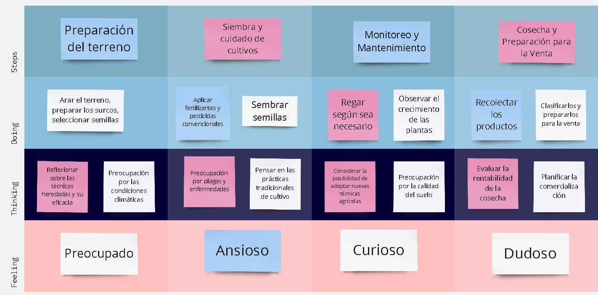
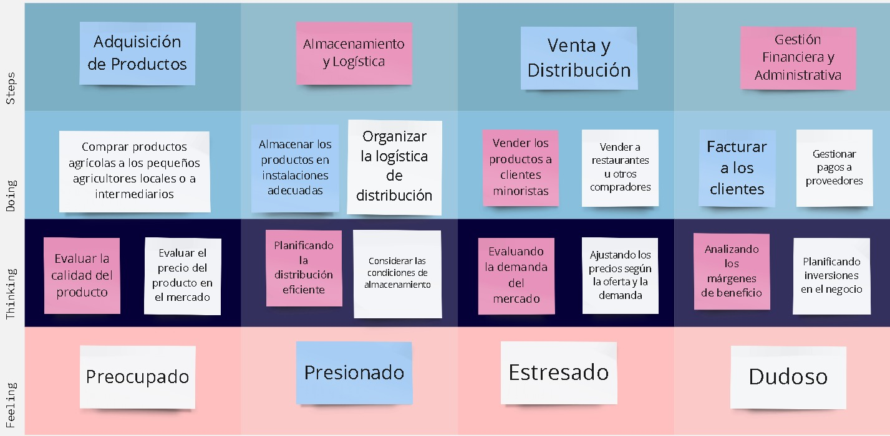
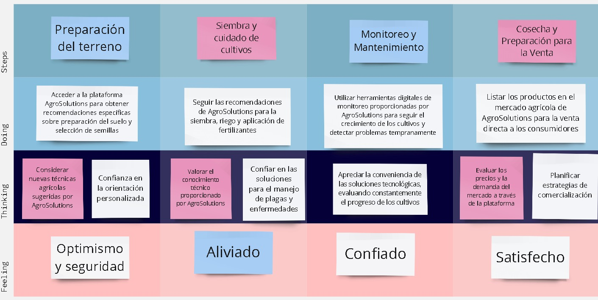
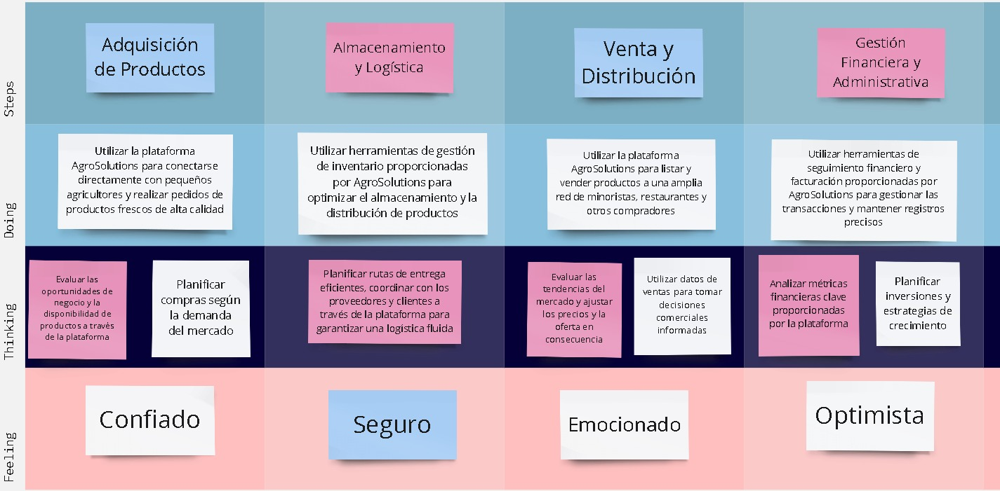
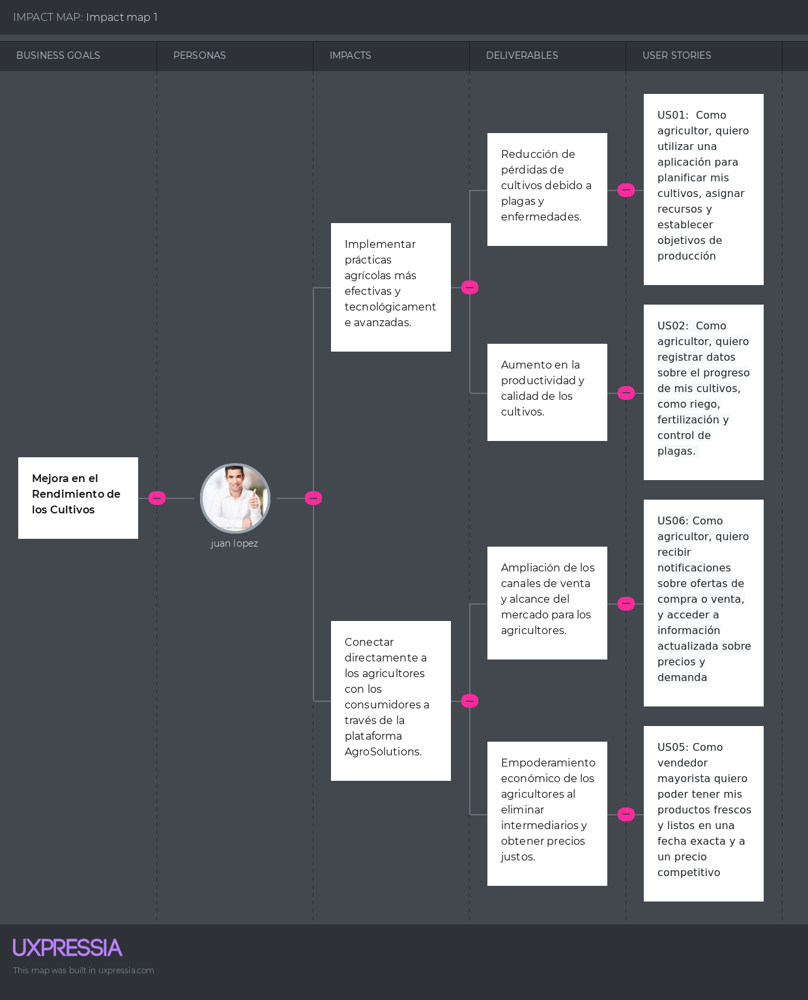
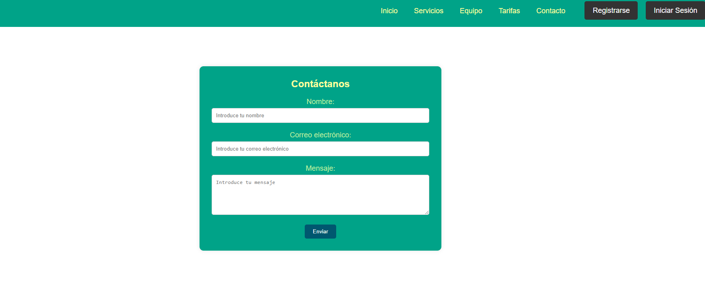
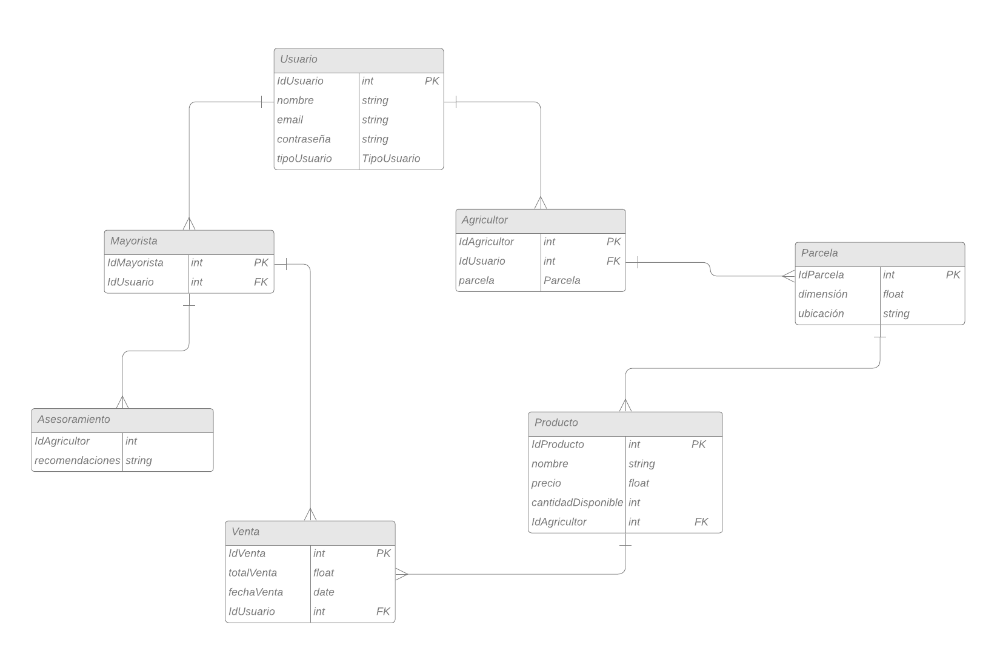

# AgroSolutions
---

# Carátula
- **Universidad**: UPC
- **Carrera**: Ing de Software
- **Ciclo**: 5
- **Curso**: Aplicaciones Web
- **Sección**: WS52
- **Profesor**: Naldo Reupo Musayo Gastulo 

---

# Informe de Trabajo Final
- **Nombre del Startup**: AgroSolutions
- **Nombre del Producto**: AgroSolutions

# Team  Members:

| Member                           | Code       |
|----------------------------------|------------|
| Alvaro  Pinto Fuentes Rivera     | u202213384 |
| Poma Espinoza Gustavo Arturo     | u20221c138 |
| Christian Renato Espinoza Saenz  | u202213208 |
| Georgina Lastra Trinidad         | u201822503 |
| Burga loarte Anaely Zarely       | u202118264 |
|                                  |            |

- **Mes y Año**: marzo del 2024

---

# Registro de Versiones del Informe
El objetivo de esta sección es resumir las modificaciones relevantes que se realizan al informe durante el ciclo de vida del proyecto. Esta sección inicia en una página nueva y se incluye un cuadro con la siguiente estructura:

| Versión | Fecha            | Autor                           | Descripción de modificación                                                                                                                                                                                               |
|---------|------------------|---------------------------------|-----------------------------------------------------------------------------------------------------------------------------------------------------------------------------------------------------------------------------|
| TB1     | Miércoles 10 de Abril | - Pinto Fuentes Rivera, Alvaro Felipe   - Burga Loarte Anaely Zarely   - Espinoza Saenz Christian Renato   - Gustavo Arturo Poma Espinoza   - Georgina Lastra Trinidad | Se han incluído los siguientes capítulos:   Capítulo I: Introducción   Capítulo II: Requirements Elicitation & Analysis   Capítulo III: Requirements Specification   Capítulo IV: Product Design   Avance del Capítulo V: Product Implementation, Validation & Deployment hasta el punto 5.2.1.8   Avance de Conclusiones, Bibliografía y Anexos |

---
# Project Report Collaboration Insights 

URL Project Report (Github): https://github.com/upc-pre-SI730-2401-WS52/AgroSolutions

Commits en reporte avance TB1

  

---

# Tabla de contenidos
- [Student Outcome](#student-outcome)
- [Capítulo I: Introducción](#capítulo-i-introducción)
    - [1.1 Startup Profile](#11-startup-profile)
        - [1.1.1 Descripción de la Startup](#111-descripción-de-la-startup)
        - [1.1.2 Perfiles de integrantes del equipo](#112-perfiles-de-integrantes-del-equipo)
    - [1.2 Solution Profile](#12-solution-profile)
        - [1.2.1 Antecedentes y problemática](#121-antecedentes-y-problemática)
        - [1.2.2 Lean UX Process](#122-lean-ux-process)
            - [1.2.2.1 Lean UX Problem Statements](#1221-lean-ux-problem-statements)
            - [1.2.2.2 Lean UX Assumptions](#1222-lean-ux-assumptions)
            - [1.2.2.3 Lean UX Hypothesis Statements](#1223-lean-ux-hypothesis-statements)
            - [1.2.2.4 Lean UX Canvas](#1224-lean-ux-canvas)
        - [1.3 Segmentos objetivo](#13-segmentos-objetivo)

- [Capítulo II: Requirements Elicitation & Analysis](#capítulo-ii-requirements-elicitation--analysis)
    - [2.1 Competidores](#21-competidores)
        - [2.1.1 Análisis competitivo](#211-análisis-competitivo)
        - [2.1.2 Estrategias y tácticas frente a competidores](#212-estrategias-y-tácticas-frente-a-competidores)
    - [2.2 Entrevistas](#22-entrevistas)
        - [2.2.1 Diseño de entrevistas](#221-diseño-de-entrevistas)
        - [2.2.2 Registro de entrevistas](#222-registro-de-entrevistas)
        - [2.2.3 Análisis de entrevistas](#223-análisis-de-entrevistas)
    - [2.3 Needfinding](#23-needfinding)
        - [2.3.1 User Personas](#231-user-personas)
        - [2.3.2 User Task Matrix](#232-user-task-matrix)
        - [2.3.3 User Journey Mapping](#233-user-journey-mapping)
        - [2.3.4 Empathy Mapping](#234-empathy-mapping)
        - [2.3.5 As-is Scenario Mapping](#235-as-is-scenario-mapping)
    - [2.4 Ubiquitous Language](#24-ubiquitous-language)

- [Capítulo III: Requirements Specification](#capítulo-iii-requirements-specification)
    - [3.1 To-Be Scenario Mapping](#31-to-be-scenario-mapping)
    - [3.2 User Stories](#32-user-stories)
    - [3.3 Impact Mapping](#33-impact-mapping)
    - [3.4 Product Backlog](#34-product-backlog)

- [Capítulo IV: Product Design](#capítulo-iv-product-design)
    - [4.1 Style Guidelines](#41-style-guidelines)
        - [4.1.1 General Style Guidelines](#411-general-style-guidelines)
        - [4.1.2 Web Style Guidelines](#412-web-style-guidelines)
    - [4.2 Information Architecture](#42-information-architecture)
        - [4.2.1 Organization Systems](#421-organization-systems)
        - [4.2.2 Labeling Systems](#422-labeling-systems)
        - [4.2.3 SEO Tags and Meta Tags](#423-seo-tags-and-meta-tags)
        - [4.2.4 Searching Systems](#424-searching-systems)
        - [4.2.5 Navigation Systems](#425-navigation-systems)
    - [4.3 Landing Page UI Design](#43-landing-page-ui-design)
        - [4.3.1 Landing Page Wireframe](#431-landing-page-wireframe)
        - [4.3.2 Landing Page Mock-up](#432-landing-page-mock-up)
    - [4.4 Web Applications UX/UI Design](#44-web-applications-uxui-design)
        - [4.4.1 Web Applications Wireframes](#441-web-applications-wireframes)
        - [4.4.2 Web Applications Wireflow Diagrams](#442-web-applications-wireflow-diagrams)
        - [4.4.3 Web Applications Mock-ups](#443-web-applications-mock-ups)
        - [4.4.4 Web Applications User Flow Diagrams](#444-web-applications-user-flow-diagrams)
    - [4.5 Web Applications Prototyping](#45-web-applications-prototyping)
    - [4.6 Domain-Driven Software Architecture](#46-domain-driven-software-architecture)
        - [4.6.1 Software Architecture Context Diagram](#461-software-architecture-context-diagram)
        - [4.6.2 Software Architecture Container Diagrams](#462-software-architecture-container-diagrams)
        - [4.6.3 Software Architecture Components Diagrams](#463-software-architecture-components-diagrams)
    - [4.7 Software Object-Oriented Design](#47-software-object-oriented-design)
        - [4.7.1 Class Diagrams](#471-class-diagrams)
        - [4.7.2 Class Dictionary](#472-class-dictionary)
    - [4.8 Database Design](#48-database-design)
        - [4.8.1 Database Diagram](#481-database-diagram)

- [Capítulo V: Product Implementation, Validation & Deployment](#capítulo-v-product-implementation-validation-deployment)
    - [5.1 Software Configuration Management](#51-software-configuration-management)
        - [5.1.1 Software Development Environment Configuration](#511-software-development-environment-configuration)
        - [5.1.2 Source Code Management](#512-source-code-management)
    - [5.2 Landing Page, Services & Applications Implementation](#52-landing-page-services-applications-implementation)
        - [5.2.1 Sprint 1](#521-sprint-1)
            - [5.2.1.1 Sprint Planning 1](#5211-sprint-planning-1)
            - [5.2.1.2 Sprint Backlog 1](#5212-sprint-backlog-1)
            - [5.2.1.3 Development Evidence for Sprint Review](#5213-development-evidence-for-sprint-review)
            - [5.2.1.4 Testing Suite Evidence for Sprint Review](#5214-testing-suite-evidence-for-sprint-review)
            - [5.2.1.5 Execution Evidence for Sprint Review](#5215-execution-evidence-for-sprint-review)
                       - [5.2.1.6 Services Documentation Evidence for Sprint Review](#5216-services-documentation-evidence-for-sprint-review)
            - [5.2.1.7 Software Deployment Evidence for Sprint Review](#5217-software-deployment-evidence-for-sprint-review)
            - [5.2.1.8 Team Collaboration Insights during Sprint](#5218-team-collaboration-insights-during-sprint)
        - [5.2.2 Sprint 2](#522-sprint-2)
            - [5.2.2.1 Sprint Planning 2](#5221-sprint-planning-2)
            - [5.2.2.2 Sprint Backlog 2](#5222-sprint-backlog-2)
            - [5.2.2.3 Development Evidence for Sprint Review](#5223-development-evidence-for-sprint-review)
            - [5.2.2.4 Testing Suite Evidence for Sprint Review](#5224-testing-suite-evidence-for-sprint-review)
            - [5.2.2.5 Execution Evidence for Sprint Review](#5225-execution-evidence-for-sprint-review)
            - [5.2.2.6 Services Documentation Evidence for Sprint Review](#5226-services-documentation-evidence-for-sprint-review)
            - [5.2.2.7 Software Deployment Evidence for Sprint Review](#5227-software-deployment-evidence-for-sprint-review)
            - [5.2.2.8 Team Collaboration Insights during Sprint](#5228-team-collaboration-insights-during-sprint)
        - [5.2.3 Sprint 3](#523-sprint-3)
            - [5.2.3.1 Sprint Planning 3](#5231-sprint-planning-3)
            - [5.2.3.2 Sprint Backlog 3](#5232-sprint-backlog-3)
            - [5.2.3.3 Development Evidence for Sprint Review](#5233-development-evidence-for-sprint-review)
            - [5.2.3.4 Testing Suite Evidence for Sprint Review](#5234-testing-suite-evidence-for-sprint-review)
            - [5.2.3.5 Execution Evidence for Sprint Review](#5235-execution-evidence-for-sprint-review)
            - [5.2.3.6 Services Documentation Evidence for Sprint Review](#5236-services-documentation-evidence-for-sprint-review)
            - [5.2.3.7 Software Deployment Evidence for Sprint Review](#5237-software-deployment-evidence-for-sprint-review)
            - [5.2.3.8 Team Collaboration Insights during Sprint](#5238-team-collaboration-insights-during-sprint)
    - [5.3 Validation Interviews](#53-validation-interviews)
        - [5.3.1 Diseño de Entrevistas](#531-diseño-entrevistas)
        - [5.3.2 Registro de Entrevistas](#532-registro-entrevistas)
        - [5.3.3 Evaluaciones según heurísticas](#533-evaluaciones-según-heurísticas)
    - [5.4 Video About-the-Product](#54-video-about-the-product)

---

# Student-Outcome

| Criterio específico                                                                                               | Acciones realizadas                                                                                                                                                                                             | Conclusiones                                                                                                                                                                                                                                                                                                                   |
|-------------------------------------------------------------------------------------------------------------------|------------------------------------------------------------------------------------------------------------------------------------------------------------------------------------------------------------------|---------------------------------------------------------------------------------------------------------------------------------------------------------------------------------------------------------------------------------------------------------------------------------------------------------------------------------|
| Participa en equipos multidisciplinarios con eficacia, eficiencia y objetividad, en el marco de un proyecto en soluciones de ingeniería de software.                           | **Pinto Fuentes Rivera, Alvaro Felipe:** Aportó constantemente ideas en reuniones y cumplió con los puntos del reporte dentro del tiempo establecido. También apoyó a compañeros con dificultades para cumplir con fechas de progreso.   **Espinoza Saenz, Christian Renato:** Realizó diferentes aportes en reuniones para avanzar el trabajo y distribuyó tareas equitativamente.   **Burga Loarte Anaely:** Trabajó con claridad y precisión en la identificación de problemas y formulación de hipótesis, investigando para entender las necesidades específicas de los agricultores peruanos y ofrecer soluciones adaptadas a sus requerimientos.   **Poma Gustavo Arturo:** Contribuyó activamente al grupo aportando ideas durante las reuniones y cumpliendo con sus responsabilidades asignadas en el informe dentro de los plazos establecidos. Además, brindó apoyo a sus compañeros en caso de que enfrentaran dificultades para asegurar que todos cumplieran con las fechas de progreso establecidas.   **Lastra Trinidad, Georgina:** Aportó colaborativamente con sus compañeros. Además, realizar una entrevista al segmento "agricultor" le permitió conocer más acerca de la necesidad del usuario y cómo pueden satisfacerla. | En esta entrega, la clave para completar la tarea con éxito fue tener una planificación minuciosa y asignar claramente las responsabilidades. Establecimos reuniones regulares para revisar el progreso y abordar cualquier desafío que surgiera durante el proceso.   Se analizaron los requisitos y objetivos del proyecto AgroSolutions, que se centra en proporcionar soluciones de software para fortalecer el sector agrícola. Esto implicó comprender las necesidades de los agricultores y los vendedores mayoristas, así como identificar las funcionalidades clave necesarias en la plataforma.   En esta entrega, nos sumergimos en el mundo agrícola mediante entrevistas tanto con agricultores como con distribuidores al por mayor. También realizamos un estudio exhaustivo de nuestros competidores, lo que nos proporcionó una comprensión más amplia de nuestra startup y del mercado en el que estamos insertos. |
| Conoce al menos un sector empresarial o dominio de aplicación de soluciones de software.                        | **Pinto Fuentes Rivera, Alvaro Felipe:** Para el desarrollo de este informe aprendió sobre los procesos de gestión del sector agrónomo, lo que le permitió comprender mejor las necesidades que deben suplir las soluciones de software destinadas a este sector empresarial.   **Espinoza Saenz, Christian Renato:** Al diseñar la solución, realizó una investigación exhaustiva del sector agrícola, explorando a fondo sus dinámicas y necesidades. Este análisis meticuloso le ayudó a identificar ventajas competitivas y áreas de oportunidad dentro del mercado agrícola, centrándose especialmente en las condiciones específicas de su país.   **Burga Loarte Anaely:** Al aplicar soluciones de software en el sector agrícola, demostró una comprensión práctica de un dominio empresarial específico. Su enfoque en entender las problemáticas del sector agrícola y ofrecer soluciones adaptadas a estas necesidades demuestra su habilidad para integrar conocimientos técnicos con demandas del mundo real.   **Poma Gustavo Arturo:** Al implementar soluciones de software en la agricultura, demostró una sólida comprensión del sector empresarial. Al enfocarse en comprender las necesidades específicas de los agricultores peruanos, pudo diseñar soluciones adaptadas que contribuyeron al éxito de proyectos de ingeniería de software en este campo. Su enfoque incluyó una investigación exhaustiva del mercado agrícola, identificando oportunidades clave y fortalezas competitivas para desarrollar soluciones efectivas y pertinentes.   **Lastra Trinidad, Georgina:** Se analizaron los requisitos y objetivos del proyecto AgroSolutions, que se centra en proporcionar soluciones de software para fortalecer el sector agrícola. Esto implicó comprender las necesidades de los agricultores y los vendedores mayoristas, así como identificar las funcionalidades clave necesarias en la plataforma. | Se sumergieron en el mundo agrícola mediante entrevistas tanto con agricultores como con distribuidores al por mayor. También realizaron un estudio exhaustivo de sus competidores, lo que les proporcionó una comprensión más amplia de su startup y del mercado en el que están insertos.                                                                                                                                                   |

# Capítulo I: Introducción
## 1.1 Startup Profile
### 1.1.1 Descripción de la Startup
AgroSolutions es una innovadora startup comprometida con el fortalecimiento del sector agrícola, ofreciendo un enfoque integral para apoyar a pequeños y medianos agricultores en el desarrollo óptimo de sus cultivos. Más allá de proporcionar información técnica y asesoramiento especializado, también actuamos como un socio comercial activo.

Nuestra plataforma no solo brinda orientación sobre las mejores prácticas agrícolas, como las temporadas ideales para el cultivo, los períodos óptimos de riego y el manejo de plagas, sino que también ofrece la oportunidad única de comercializar directamente los productos de los agricultores. Compramos sus productos y los ponemos a la venta en nuestra plataforma en línea, permitiendo a los agricultores llegar a una audiencia más amplia y obtener un mejor retorno de su inversión.

Además de este servicio, facilitamos a los agricultores la posibilidad de programar visitas de nuestros profesionales a sus terrenos para realizar evaluaciones específicas y ofrecer recomendaciones personalizadas. Creemos firmemente en la importancia de la atención individualizada para garantizar un mejor desempeño en sus cultivos.

En resumen, en AgroSolutions encontrarás el respaldo necesario para impulsar tu producción agrícola, con acceso a información precisa, asistencia de expertos y una plataforma para comercializar tus productos de manera eficiente. Juntos, trabajaremos para alcanzar el éxito en tu actividad agrícola.

### 1.1.2 Perfiles de integrantes del equipo

| Nombre y Foto                                                   | Descripción                                                                                                                                                                                                                                                                                                                                                                    |
|-----------------------------------------------------------------|--------------------------------------------------------------------------------------------------------------------------------------------------------------------------------------------------------------------------------------------------------------------------------------------------------------------------------------------------------------------------------|
|Gustavo Arturo Poma Espinoza  | Soy estudiante del quinto ciclo de la carrera Ingeniería de Software. Disfruto escuchando música, ya que siento que esta actividad me inspira creatividad. Salir a caminar con mis mascotas me ayuda a relajarme y meditar. Además, soy aficionado a las artes marciales, las cuales me han inculcado disciplina y perseverancia. Mi color favorito es el azul. Estoy disponible para ayudar siempre a mis compañeros y tiendo a generar buenas relaciones sociales con diferentes tipos de personas gracias a mi tolerancia y capacidad de trabajo en equipo. |
|Alvaro Felipe Pinto Fuentes Rivera | Hola, mi nombre es Alvaro, soy un estudiante del quinto ciclo de la carrera Ingeniería de Software. Me gusta mucho leer, sobretodo el genero de fantasía y ciencia ficción, mi frase favorita de un libro es el credo "Vida antes que muerte, fuerza antes que debilidad y viaje antes que destino", también soy un gran fan del cine y pasó la mayor parte de mi tiempo libre escribiendo por diversión. Poseo un nivel bueno de programación en los lenguajes de C# y C++, creo que podré resultar de gran ayuda para resolver cualquier tipo de problema durante el desarrollo del proyecto, así como podré brindar ideas creativas para el equipo. |
|Christian Renato Espinoza Saenz | Actualmente cursando el quinto ciclo de la carrera Ingeniería de Software, mi nombre es Christian, tengo 19 años y mi color favorito es el guinda. Me encanta escuchar música, jugar videojuegos como Team Fortress 2 y Persona 2: Innocent Sin, y también tocar el teclado. Poseo ideas únicas, estrafalarias e innovadoras para que el trabajo logre sobresalir. Adicionalmente, tengo experiencia en la creación de distintos tipos de diagramas, editar diferentes tipos de multimedia como videos, y un conocimiento general en programación de C++, HTML, CSS y SQL, que será beneficioso para el proyecto. |
| Georgina Lastra Trinidad | Soy estudiante de Ingeniería de Software. Mi curiosidad y mi entusiasmo por comprender cómo funcionan las cosas me llevaron a elegir este campo como mi camino profesional. Soy una estudiante comprometida y persistente que busca convertirse en una ingeniera innovadora con visión de futuro. Estoy emocionada por contribuir al desarrollo de soluciones tecnológicas impactantes que mejoren  la vida de las personas de todo el mundo. |
|Anaely Zarely Burga Loarte | Soy estudiante del quinto ciclo de la carrera Ingeniería de Software. Mis pasatiempos son escuchar música, ver películas y leer. Me considero responsable y perseverante. En términos de habilidades, tengo experiencia en programación, especialmente en los lenguajes C++, html y css. Cont coribuiré con mis habilidades y conocimientos a este proyecto, y estoy seguro de que, con trabajo en equipo, alcanzaremos buenos resultados. |

## 1.2 Solution Profile
- Nombre del Producto: Plataforma AgroSolutions

- Descripción del Producto: La plataforma AgroSolutions representa una solución completa destinada a proporcionar orientación y asistencia a agricultores de pequeña y mediana escala para optimizar el desarrollo de sus cultivos. Este recurso digital ofrece acceso a información técnica actualizada sobre las mejores prácticas agrícolas, tales como las épocas más adecuadas para el cultivo, métodos eficaces de riego y estrategias de control de plagas. Más allá de ser una fuente informativa, AgroSolutions también funciona como un socio comercial activo al permitir que los agricultores comercialicen sus productos directamente en línea, ampliando su visibilidad y maximizando su retorno de inversión. Además, la plataforma facilita la programación de visitas personalizadas de expertos a los terrenos de los agricultores, garantizando una atención individualizada para mejorar el rendimiento de los cultivos.

- Monetización: Para mantener su operación y continuar ofreciendo servicios de calidad, AgroSolutions implementa una variedad de estrategias de monetización. Esto incluye la obtención de ingresos a través de comisiones por ventas, donde se aplica un cargo sobre cada transacción realizada en la plataforma. Asimismo, se ofrecen servicios de consultoría y evaluación personalizada por una tarifa, lo que implica la visita de expertos a los terrenos de los agricultores para brindar asesoramiento especializado. AgroSolutions también genera ingresos mediante acuerdos publicitarios y patrocinios con empresas vinculadas al sector agrícola, además de contemplar la posibilidad de una suscripción premium que otorgue acceso a funciones exclusivas y contenido adicional por una tarifa periódica. Este enfoque diversificado garantiza la sostenibilidad financiera de la plataforma y su capacidad para adaptarse a las cambiantes demandas del mercado agrícola, al tiempo que sigue brindando un valioso apoyo a los agricultores.

### 1.2.1 Antecedentes y problemática
- En los últimos años, el sector agrícola en el Perú ha enfrentado desafíos significativos, incluyendo la falta de acceso a información técnica actualizada, asesoramiento especializado y mercados eficientes para la comercialización de productos. Estudios locales resaltan la importancia de considerar factores como las condiciones climáticas, la disponibilidad de recursos hídricos y la calidad del suelo para el éxito de las operaciones agrícolas. En respuesta a estas necesidades, AgroSolutions emerge como una innovadora startup nacional comprometida con abordar estas problemáticas y ofrecer soluciones integrales para impulsar la producción agrícola en el país. 
- La empresa no solo proporciona información precisa y asistencia de expertos, sino que también actúa como un socio comercial activo, facilitando la comercialización directa de los productos agrícolas a través de una plataforma en línea. Además, ofrece servicios personalizados de consultoría y evaluación, asegurando un enfoque individualizado y eficaz en el manejo de los cultivos. La misión de AgroSolutions es impulsar el desarrollo del sector agrícola peruano, contribuyendo al crecimiento económico y social de las comunidades rurales mediante la integración de tecnología avanzada y un compromiso firme con la sostenibilidad.

* What?
    * La startup AgroSolutions se encarga de desarrollar y mantener la plataforma, la cual cuenta con especialistas en agricultura y expertos en comercialización. Además, está dirigida a pequeños y medianos agricultores peruanos que buscan mejorar su producción y         rentabilidad.

* When?
    * La aplicación y los servicios de AgroSolutions están disponibles en todo momento, permitiendo a los usuarios acceder a recursos y apoyo cuando lo necesiten. Los agricultores pueden realizar consultas en la plataforma las 24 horas del día, los 7 días de la             semana.

* Where?
    * AgroSolutions opera en el Perú, específicamente dirigido a los agricultores del país que buscan mejorar sus prácticas agrícolas y optimizar el rendimiento de sus cultivos.
  
* Why?
    * El propósito de AgroSolutions es proporcionar un espacio seguro y accesible donde los agricultores peruanos puedan acceder a información precisa y asistencia experta. El objetivo es mejorar la productividad y rentabilidad de los agricultores, contribuyendo así        al desarrollo económico y social del país.

* How?
    * AgroSolutions ofrece una plataforma en línea que brinda orientación sobre mejores prácticas agrícolas, asesoramiento personalizado y la oportunidad de comercializar directamente los productos agrícolas. Además, los agricultores pueden programar visitas de             profesionales a sus terrenos para recibir evaluaciones específicas y recomendaciones.

* How much?
    * Los costos de los servicios de AgroSolutions pueden variar dependiendo del tipo y alcance de los servicios requeridos por los agricultores. La plataforma ofrece una gama de opciones, desde acceso gratuito a ciertos recursos básicos hasta planes de suscripción         que proporcionan beneficios adicionales, como análisis detallados de la salud de los cultivos y la posibilidad de reservar consultas con especialistas.

### 1.2.2 Lean UX Process

#### 1.2.2.1 Lean UX Problem Statements

Para los agricultores de pequeña y mediana escala en el Perú, obtener acceso a información agrícola actualizada, orientación especializada y un canal eficiente para la venta de sus productos representa un desafío constante. A diferencia de las alternativas convencionales, como consultorías agrícolas costosas o mercados locales limitados, no existe una solución centralizada y completa que satisfaga estas necesidades de manera efectiva. Esta disparidad en los recursos disponibles dificulta que los agricultores maximicen el rendimiento de sus cultivos y obtengan un retorno óptimo de su inversión. Por lo tanto, nuestro objetivo es ofrecer a los agricultores una solución integral y efectiva que les permita acceder a información técnica precisa, recibir asesoramiento personalizado y comercializar sus productos de manera eficiente. A través de nuestra plataforma, nos esforzamos por crear un ambiente inclusivo y accesible donde los agricultores puedan conectarse con expertos en agronomía y otros usuarios dispuestos a ofrecer orientación y apoyo. Así, como startup, nos planteamos la siguiente interrogante: ¿Cómo podemos resolver los desafíos que enfrentan nuestros usuarios para brindar una solución integral y efectiva que fortalezca el sector agrícola en el Perú?

#### 1.2.2.2 Lean UX Assumptions

| Business Assumptions                                                                                                 | User Assumptions                                                                                                          |
|----------------------------------------------------------------------------------------------------------------------|---------------------------------------------------------------------------------------------------------------------------|
| Se presume que existe una demanda creciente de soluciones integrales para fortalecer el sector agrícola, respaldando así la viabilidad a largo plazo de AgroSolutions. | Se asume que los agricultores están interesados en mejorar sus prácticas agrícolas y aumentar su rentabilidad.           |
| Se presupone que los agricultores están dispuestos a adoptar tecnologías agrícolas modernas para mejorar la eficiencia y la productividad en sus cultivos.         | Se asume que los agricultores percibirán la información y servicios proporcionados por AgroSolutions como valiosos y útiles para su trabajo diario. |
| Se asume que la comercialización directa de los productos agrícolas a través de la plataforma de AgroSolutions generará un aumento significativo en los ingresos de los agricultores. | Se presume que los agricultores valorarán la accesibilidad a nuevos mercados y oportunidades de venta ofrecidas por AgroSolutions. |
| Se presupone que los agricultores buscan asesoramiento personalizado y soluciones adaptadas a sus necesidades específicas para optimizar el rendimiento de sus cultivos. | Se asume que los agricultores estarán dispuestos a pagar por servicios de asesoramiento especializado y visitas de profesionales a sus terrenos. |
| Se presume que la comunidad agrícola estará interesada en participar en foros de discusión y compartir conocimientos para mejorar sus prácticas agrícolas.          | Se asume que los agricultores encontrarán valor en la interacción con otros usuarios y expertos en agronomía dentro de la plataforma de AgroSolutions. |
| Se presume que los agricultores prefieren una plataforma intuitiva y fácil de usar para acceder a información agrícola y servicios relacionados con la agricultura. | Se presume que los agricultores de diversas edades y niveles de experiencia encontrarán la plataforma de AgroSolutions accesible y fácil de navegar. |
| Se presume que la oferta de eventos y talleres gratuitos a cargo de expertos agrícolas será bien recibida por la comunidad agrícola, fomentando la participación y el compromiso. | Se asume que los agricultores estarán interesados en participar en eventos educativos y talleres para mejorar sus habilidades y conocimientos agrícolas. |
| Se asume que la implementación de una suscripción premium con características adicionales generará ingresos adicionales y aumentará la retención de usuarios. | Se presupone que los agricultores estarán dispuestos a pagar por una suscripción premium que ofrezca acceso a funciones exclusivas y beneficios adicionales dentro de la plataforma de AgroSolutions. |
| Se presume que la capacidad de dejar reseñas y calificaciones a los especialistas agrícolas incentivará la transparencia y la confianza en la plataforma de AgroSolutions. | Se asume que los agricultores valorarán la posibilidad de compartir sus experiencias y opiniones sobre los servicios recibidos en la plataforma de AgroSolutions. |
| Se asume que la integración de herramientas de análisis de datos agrícolas facilitará a los agricultores la toma de decisiones informadas para mejorar la productividad de sus cultivos. | Se presume que los agricultores encontrarán valor en el análisis de datos agrícolas proporcionado por AgroSolutions para optimizar sus prácticas y maximizar sus rendimientos. |

#### 1.2.2.3 Lean UX Hypothesis Statements

1. Creemos que al proporcionar a los agricultores acceso a información agrícola actualizada y especializada, mejoraremos su capacidad para tomar decisiones informadas sobre el manejo de cultivos, lo que conducirá a una mayor productividad y rentabilidad.

2. Creemos que al facilitar a los agricultores una plataforma centralizada y eficiente para la comercialización de sus productos agrícolas, aumentaremos su acceso a mercados más amplios y mejoraremos sus oportunidades de venta, generando mayores ingresos y competitividad.

3. Suponemos que al ofrecer a los agricultores asesoramiento personalizado y visitas de profesionales a sus terrenos, podremos identificar y abordar sus desafíos específicos de manera más efectiva, lo que resultará en un mejor rendimiento de los cultivos y mayor satisfacción del cliente.

4. Creemos que al crear un entorno inclusivo y accesible en nuestra plataforma, donde los agricultores puedan conectarse con expertos en agronomía y otros usuarios para compartir conocimientos y experiencias, fomentaremos la colaboración y el intercambio de mejores prácticas, impulsando el crecimiento y desarrollo en el sector agrícola.

5. Suponemos que al ofrecer servicios de calidad y efectivos a los agricultores, satisfaremos sus necesidades y superaremos sus expectativas, lo que resultará en una mayor retención de clientes, recomendaciones positivas y un crecimiento sostenible para AgroSolutions.

#### 1.2.2.4 Lean UX Canvas

---

## 1.3 Segmentos objetivo

| Variables         | Segmento 1                                                                                                                      | Segmento 2                                                                                                                 |
|-------------------|---------------------------------------------------------------------------------------------------------------------------------|----------------------------------------------------------------------------------------------------------------------------|
| Geográfica        | El mercado objetivo se encuentra en Perú, donde la agricultura es una parte vital de la economía y la sociedad.                | Los especialistas interesados en brindar servicios se encuentran en Perú, trabajando en centros de salud certificados.        |
| Demográfica       | No hay restricciones específicas en términos de edad o género. El segmento puede incluir desde jóvenes adultos hasta personas mayores. | Los especialistas deben ser profesionales certificados y estar trabajando en centros de salud reconocidos en Perú.          |
| Psicológica       | Los usuarios pueden estar interesados en mejorar sus habilidades agrícolas, buscar soluciones a problemas específicos o simplemente aprender más sobre agricultura. | Los especialistas deben demostrar habilidades de comunicación efectiva, empatía y un compromiso con los estándares éticos. |
| Función de comportamiento | Los usuarios pueden buscar activamente plataformas en línea donde puedan obtener información, compartir experiencias y conectarse con otros entusiastas de la agricultura. | Los especialistas deben estar dispuestos a colaborar con otros profesionales y estar abiertos a ampliar su base de clientes. Actúan buscando oportunidades para compartir sus conocimientos y habilidades con aquellos que los necesitan. |

---
# Capítulo II: Requirements Elicitation & Analysis
## 2.1 Competidores
### 2.1.1 Análisis competitivo
En este análisis, hemos identificado tres aplicaciones con funcionalidades similares a nuestra propuesta. SiAR se enfoca en la gestión de riego, calculando las necesidades hídricas y dosis de riego. Agricolum ofrece la consolidación de datos de una explotación agrícola en una sola aplicación. Por último, PlantCare ayuda a encontrar productos fitosanitarios y a tratar cultivos afectados por plagas específicas.

### 2.1.2 Estrategias y tácticas frente a competidores

-Después de realizar un análisis exhaustivo del mercado y de las diversas aplicaciones disponibles para el sector agrícola, hemos identificado nuestras fortalezas y áreas de mejora. En particular, destacamos nuestra capacidad única para proporcionar asesoramiento técnico y facilitar la comercialización directa de productos, lo que nos diferencia claramente de otras plataformas. Esta ventaja nos permite satisfacer de manera más efectiva las necesidades tanto de los agricultores individuales como de los compradores mayoristas.
En torno al precio, este se justificará con base en el contenido que ofrecemos. Además, durante los primeros meses después del lanzamiento al mercado, brindaremos distintos descuentos para promover la adopción de la aplicación.
Por otro lado, al expandir nuestro alcance y participación en eventos agrícolas relevantes y en redes sociales especializadas, estamos fortaleciendo nuestra presencia en la comunidad agrícola. Este enfoque estratégico nos posiciona no solo como una plataforma tecnológica, sino también como un aliado activo y confiable para agricultores y compradores mayoristas por igual.-

## 2.2 Entrevistas

### 2.2.1 Diseño de entrevistas

Segmento 1: Pequeños agricultores
- ¿Tienes familiares que participen en la actividad agrícola contigo?
- ¿Cuál es tu ocupación principal?
- Experiencia y habilidades:
- ¿Cuánto tiempo llevas dedicándote a la agricultura?
- ¿Qué tipo de cultivos sueles cultivar?
- ¿Tienes alguna formación o capacitación relacionada con la agricultura?
- ¿Qué habilidades consideras más importantes para el éxito en la agricultura?
- Tecnología y preferencias digitales:
- ¿Qué dispositivos tecnológicos utilizas en tu día a día?
- ¿Qué tipo de navegadores de internet prefieres utilizar?
- ¿Sueles interactuar con plataformas en línea relacionadas con la agricultura?
- ¿Cómo prefieres recibir información relacionada con la agricultura: a través de - internet, libros, cursos presenciales, etc.?
- Objetivos y frustraciones:
- ¿Cuáles son tus principales objetivos como agricultor?
- ¿Qué dificultades o frustraciones has enfrentado en tu actividad agrícola?
- ¿Qué aspectos consideras más importantes para mejorar el rendimiento de tus cultivos?
- Interacciones y preferencias comerciales:
- ¿Cómo sueles comercializar tus productos agrícolas actualmente?
- ¿Has utilizado plataformas en línea para vender tus productos anteriormente?
- ¿Qué aspectos valoras más al momento de elegir una plataforma para vender tus productos agrícolas?
- Influencias y referencias:
- ¿Qué marcas o empresas relacionadas con la agricultura conoces y confías?
- ¿Tienes algún referente o persona a la que acudes para obtener información o consejos sobre agricultura?

Segmento 2: Vendedores de verduras mayoristas  
- ¿Con qué frecuencia compras verduras frescas?
- ¿Cuáles son tus verduras frescas favoritas y por qué?
- ¿Qué factores consideras al elegir dónde comprar tus verduras frescas?
- ¿Prefieres comprar tus verduras frescas en línea o en una tienda física? ¿Por qué?
- ¿Qué te gustaría ver en una tienda virtual de vegetales frescos para sentirte más cómodo/a al hacer tus compras?
- ¿Qué tan importante es para ti la calidad y frescura de las verduras que compras?
- ¿Qué variedades de verduras frescas te gustaría encontrar con mayor frecuencia en una tienda virtual de vegetales frescos?
- ¿Considerarías comprar verduras frescas al por mayor si se ofrecen a precios competitivos?
- ¿Qué servicios adicionales valorarías en una tienda virtual de vegetales frescos, como entrega a domicilio o recetas sugeridas?
- ¿Hay algún problema o inconveniente que hayas experimentado al comprar verduras frescas que te gustaría que se abordara en una tienda virtual de vegetales frescos?
- ¿Te gustaría tener la opción de dejar comentarios o reseñas sobre los productos que compraste en una tienda virtual de vegetales frescos?
- ¿Qué políticas de devolución considerarías justas y convenientes al comprar verduras frescas en línea?
- ¿Qué tan importante es para ti la accesibilidad y la usabilidad del sitio web de la tienda virtual de vegetales frescos al hacer tus compras?
- ¿Te gustaría tener la opción de personalizar tus pedidos de verduras frescas en una tienda en línea? Por ejemplo, seleccionar la madurez de los productos o elegir un tamaño específico.
- ¿Qué medidas de seguridad esperarías que implementara una tienda virtual de vegetales frescos para garantizar la frescura y la calidad de los productos durante el envío?
- ¿Cómo te sentirías acerca de la posibilidad de recibir muestras gratuitas de verduras frescas junto con tus pedidos en una tienda virtual de vegetales frescos como incentivo para probar nuevos productos?
- ¿Te gustaría tener la opción de programar entregas regulares de verduras frescas en una tienda virtual?
- ¿Qué tipo de información sobre la procedencia de las verduras frescas valorarías más al comprar en línea? Por ejemplo, detalles sobre el agricultor o la región de cultivo.
- ¿Considerarías importante la disponibilidad de opciones de suscripción para recibir entregas regulares de verduras frescas en una tienda virtual?
### 2.2.2 Registro de entrevistas

#### Segmento Objetivo1 : Pequeños agricultores
### Entrevista 1 
- Entrevistador: Christian Renato Espinoza Saenz 
- Entrevistado: Diego Cano 
- Datos del Entrevistado: 
- Edad:23 años
- Distrito: Trujillo
- Resumen:
  Diego Cano, un joven productor frutal de 23 años, continúa el legado familiar de cultivar manzanas y pitahayas. Heredó de su familia no solo el amor por el cultivo, sino también el profundo respeto por la tierra y el arduo trabajo que implica trabajar en esta zona. Diego nos compartió la importancia de mantener su campo en óptimas condiciones y su deseo de recibir asesoramiento especializado, especialmente porque no se considera muy versado en términos de comercio. Destacó que lo que más valoraría sería un diagnóstico detallado de su campo, que le brinde la certeza de que está tomando las decisiones correctas para optimizar su producción y asegurar el éxito a largo plazo. Diego utiliza su teléfono Android para gestionar algunas tareas relacionadas con su producción, y utiliza productos John Deere para ayudar en el trabajo agrícola.
- Link : https://youtu.be/ttzGvp5tMYQ

  

### Entrevista 2 

- Entrevistador: Georgina Lastra Trinidad
- Entrevistado: Orlando Roca Huapaya
- Datos Generales:
- Edad: 28 años
- Ocupación: Agrónomo
- Residencia: Ica, Perú
- Redes sociales: WhatsApp, Instagram
- Dispositivos: Android, Windows
- Resumen:
Orlando es un pequeño agricultor de tomates con 3 años de experiencia en el sector agrícola. Él nos comenta una de los desafios a lo que se enfrenta es el control de plagas, enfermedades y la gestón de riego a las plantas. 

Link de la entrevista: https://youtu.be/6v2mfmt39oI

  

### Entrevista 3
- Entrevistador: Alvaro Felipe Pinto Fuentes Rivera
- Entrevistado: Miguel Lopez 
- Datos del Entrevistado:
- Edad: 20 años
- Distrito: Trujillo
- Resumen:
El entrevistado Miguel Lopez tiene 20 años, trabaja en el negocio familiar de la agricultura desde pequeño por lo que está bastante familiarizado con el sector laboral, gracias a la entrevista se pudo obtener mayor información sobre el segmento objetivo con el que estamos trabajando. También, estuvo de acuerdo en que el sector laboral que maneja su familia es realmente pesado y muchas veces se presentan dificultades, por lo que al explicarle las funciones que ofrece nuestra solución de software, Miguel mostró interés y mencionó que su familia utiliza productos de Sicra para optimizar algunas de sus operaciones agrícolas.
- Link : https://youtu.be/Fh4fFaK-nhY

  

 #### Segmento Objetivo2 : Vendedores de verduras mayoristas

 Entrevista 1 
- Entrevistador: Christian Renato Espinoza Saenz 
- Entrevistado: Sebastian Palacios
- Datos del Entrevistado: 
- Edad:29 años
- Distrito: San Juan de Miraflores
- Resumen:
  Sebastián Palacios, propietario de un local en San Juan de Miraflores, se esfuerza por ofrecer productos frescos y de alta calidad. En la entrevista, un vendedor mayorista de verduras frescas destaca la importancia de la calidad y la frescura, comprando con frecuencia para mantener un suministro constante. Prefiere la compra en tienda física pero valora la conveniencia en línea. Destaca la importancia de servicios como la entrega a domicilio y la variedad de productos, y señala la necesidad de abordar problemas de calidad inconsistente en el comercio en línea. Sebastián trabaja con su computadora Windows para gestionar aspectos operativos de su negocio, y se inspira en iniciativas como Wasi para mejorar su gestión de inventario y atención al cliente.
- Link : https://youtu.be/fE1h3W8MHWM

  

Entrevista 2
- Entrevistador: Alvaro Felipe Pinto Fuentes Rivera
- Entrevistada: Darling Soto
- Datos del entrevistado:
- Edad: 41 años
- Distrito: La victoria
- Resumen
  Darling Soto es una emprendedora con gran experiencia en el sector mayorista de verduras frescas. Las respuestas de Darling reflejan que pese a su predilección por la compra fisica de verduras frescas le interesa mucho el comercio online y que de darse el caso y una buena estructura estaría interesada. Su enfoque en la frescura y la variedad de productos muestra su comprensión de las necesidades cambiantes de los consumidores y su disposición para adaptarse a ellas. Además, su apertura a la compra en línea demuestra su disposición para explorar nuevas oportunidades y tecnologías en el mercado.
- Link : https://youtu.be/934T15T1oqY

  

### 2.2.3 Análisis de entrevistas

#### Segmento Objetivo1 : Pequeños agricultores
Para el segmento objetivo de pequeños agricultores, se destaca un amplio uso de dispositivos móviles Android, siendo aproximadamente dos tercios de los entrevistados, es decir, alrededor del 67%, quienes emplean esta plataforma. Además, se observa una diversidad en las herramientas tecnológicas utilizadas en sus operaciones agrícolas, donde alrededor de un tercio de los entrevistados, aproximadamente el 33%, emplea productos de Sicra y otro tercio utiliza productos John Deere, resaltando así la variedad de soluciones tecnológicas adaptadas a las necesidades del sector. En cuanto a deseos y preocupaciones, los agricultores expresan un deseo de recibir asesoramiento especializado para optimizar su producción y asegurar el éxito a largo plazo, evidenciando así una preocupación por tomar decisiones correctas en un contexto donde el comercio no es su especialidad.

#### Segmento Objetivo2 : Vendedores de verduras mayoristas
Para el segmento objetivo de vendedores de verduras mayoristas, se evidencia una preferencia notable por el uso de computadoras con sistema Windows, con alrededor del 50% de los entrevistados optando por esta plataforma para gestionar aspectos operativos de sus negocios. Además, aproximadamente dos tercios de los entrevistados, es decir, alrededor del 67%, se inspiran en soluciones como Wasi para mejorar la gestión de inventario y la atención al cliente, lo que demuestra la relevancia de la innovación tecnológica en este sector. En cuanto a deseos y preocupaciones, los vendedores mayoristas expresan la importancia de abordar problemas de calidad inconsistente en el comercio en línea, así como el interés por servicios como la entrega a domicilio y la variedad de productos, evidenciando una preocupación por adaptarse a las demandas cambiantes del mercado.

## 2.3 Needfinding
### 2.3.1 User Personas
Para asegurar que nuestra aplicación satisfaga las necesidades específicas de nuestros usuarios, hemos identificado dos segmentos objetivos principales: Pequeños agricultores y Vendedores de verduras mayoristas. A continuación, detallamos las User Personas para cada segmento.
### Segmento 1: Pequeños Agricultores

  

### Segmento 2: Vendedores de Verduras Mayoristas

  

### 2.3.2 User Task Matrix
En este apartado, evaluamos las actividades habitualmente llevadas a cabo por cada segmento objetivo, categorizándolas según su frecuencia e importancia. Este enfoque nos permite identificar las áreas prioritarias de mejora en nuestro proyecto.

  

### 2.3.3 User Journey Mapping
Creamos los User Journey Maps con el fin de comprender cómo se siente nuestro usuario al utilizar nuestra aplicación. Por esta razón, detallamos cada paso que realiza el cliente, identificando las áreas que pueden mejorarse.
#### Segmento 1: Pequeños Agricultores

  

#### Segmento 2: Vendedores de Verduras Mayoristas

  

### 2.3.4 Empathy Mapping
Desarrollamos los Empathy Maps para profundizar en la comprensión del usuario a través de aspectos como sus emociones y pensamientos.
#### Segmento 1: Pequeños Agricultores

  

#### Segmento 2: Vendedores de Verduras Mayoristas

  

### 2.3.5 As-is Scenario Mapping
En esta sección procedemos a realizar el needfinding con los as-is scenarios map. Estos son mapas que, a través de una serie de pasos, cuentan lo que nuestros usuarios hacen, piensan y sienten. Este se elabora en búsqueda de puntos débiles del proceso en los que la plataforma web pueda simplificar.

#### Segmento 1: Pequeños Agricultores

  

#### Segmento 2: Vendedores de Verduras Mayoristas

  

## 2.4 Ubiquitous Language
### Pequeños Agricultores:
Definición: Agricultores que poseen y trabajan en parcelas de tierra relativamente pequeñas, generalmente con recursos limitados y dependientes de técnicas agrícolas tradicionales.
### Vendedores Mayoristas de Verduras:
Definición: Empresas o individuos que compran productos agrícolas a pequeños agricultores y los venden a granel a minoristas, restaurantes u otros compradores.
### Plataforma AgroSolutions:
Definición: La aplicación web y plataforma en línea desarrollada por AgroSolutions para ofrecer servicios y apoyo integral a pequeños agricultores y vendedores mayoristas de verduras.
### Asesoramiento Agrícola Personalizado:
Definición: Servicio proporcionado por AgroSolutions que implica visitas de profesionales agrícolas a las parcelas de los agricultores para evaluar y ofrecer recomendaciones específicas para mejorar el rendimiento de los cultivos.
### Comercialización Directa:
Definición: Proceso facilitado por AgroSolutions que permite a los agricultores vender sus productos directamente a través de la plataforma en línea, eliminando intermediarios y llegando a una audiencia más amplia.
### Gestión de Plagas y Enfermedades:
Definición: Servicio proporcionado por AgroSolutions que implica el asesoramiento y la asistencia en el manejo de plagas y enfermedades que afectan a los cultivos de los agricultores.
### Optimización del Riego y Fertilización:
Definición: Servicio de AgroSolutions que proporciona orientación sobre los mejores métodos y momentos para el riego y la aplicación de fertilizantes, con el objetivo de maximizar el rendimiento de los cultivos.
### Mercado Agrícola:
Definición: La sección de la plataforma AgroSolutions dedicada a la compra y venta de productos agrícolas, donde los agricultores pueden listar sus productos para su venta directa y los vendedores mayoristas pueden comprar productos a granel.

# Capítulo III: Requirements Specification
## 3.1 To-Be Scenario Mapping
#### Segmento 1: Pequeños Agricultores

  

#### Segmento 2: Vendedores de Verduras Mayoristas

  

## 3.2 User Stories

| **Epic ID** | **Título** |
|--------|-----------|
|EPIC001|Planificación de Cultivos y Gestión de Insumos|
|EPIC002|Seguimiento de Operaciones y Toma de Decisiones|
|EPIC003|Comunicación y Colaboración|
|EPIC004|Comercialización y distribución|

| **ID** | **Título** | **Descripción** | **Criterios de Aceptación** | **Relacionado con (Epic ID)** |
|--------|-----------|-----------------|-----------------------------|---------------------------------|
| US001 | Planificación de Cultivos y Gestión de Insumos | Como agricultor, quiero utilizar una aplicación para planificar mis cultivos, asignar recursos y establecer objetivos de producción. Esto me permitirá tomar decisiones informadas y optimizar mis operaciones agrícolas. | - Puedo crear un plan de cultivo para la próxima temporada. - Puedo asignar recursos como semillas, fertilizantes y agua a cada cultivo. - Puedo establecer metas de producción para cada tipo de cultivo. | EPIC001 |
| US002 | Seguimiento de Operaciones y Toma de Decisiones | Como agricultor, quiero registrar datos sobre el progreso de mis cultivos, como riego, fertilización y control de plagas. Esto me ayudará a evaluar el rendimiento de mis cultivos y buscar oportunidades de mejora. | - Puedo ingresar datos diarios sobre las operaciones realizadas en cada cultivo. - Puedo visualizar gráficos y métricas que muestran el progreso de mis cultivos. - Puedo recibir alertas cuando se requiere acción o ajuste. | EPIC001 |
| US003 | Comunicación y Colaboración | Como agricultor, quiero comunicarme con otros miembros del equipo, proveedores y compradores a través de una aplicación. Esto me permitirá considerar la logística, los precios de mercado y las estrategias de venta. | - Puedo enviar mensajes a otros usuarios dentro de la aplicación. - Puedo recibir notificaciones sobre ofertas de compra o venta. - Puedo acceder a información actualizada sobre precios y demanda. | EPIC003 |
| US004 | Evaluación y Adaptación | Como agricultor, quiero analizar datos históricos y métricas clave para evaluar el éxito de mis operaciones. Reflexionar sobre las decisiones tomadas y ajustar mi enfoque según sea necesario. | - Puedo generar informes que resuman el rendimiento de mis cultivos en temporadas anteriores. - Puedo identificar áreas de mejora y tomar medidas correctivas. - Puedo adaptar mi estrategia según los cambios en el entorno o las condiciones climáticas. | EPIC002 |
| US005 | Distribución y venta  | Como vendedor mayorista quiero poder tener mis productos frescos y listos en una fecha exacta y a un precio competitivo.  | - Puedo buscar entre los diferentes agricultores y cosechas. - Puedo comprar directamente y hacer un seguimiento a mi carga. | EPIC004 |
| US006 | Precios y Demandas en Tiempo Real | Como agricultor, quiero recibir notificaciones sobre ofertas de compra o venta, y acceder a información actualizada sobre precios y demanda. | - **Dado** que accedo a la aplicación, **Cuando** la aplicación muestra información actualizada sobre precios de mercado y demanda de productos agrícolas, **Entonces** puedo tomar decisiones informadas sobre mis cultivos. - **Dado** que configuro notificaciones, **Cuando** recibo alertas sobre cambios significativos en los precios o demanda, **Entonces** puedo reaccionar rápidamente a las oportunidades del mercado. - **Dado** que accedo a la aplicación, **Cuando** accedo a información actualizada sobre precios de mercado y demanda, **Entonces** puedo tomar decisiones estratégicas basadas en datos en tiempo real. | EPIC004 |

## 3.3 Impact Mapping

  

## 3.4 Product Backlog
|Usuario|User Story|Título|Descripción|Story points|
|-|-|-|-|-|
|1|US01|Planificación de Cultivos y Gestión de Insumos|Como agricultor, quiero utilizar una aplicación para planificar mis cultivos,asignar recursos y establecer objetivos de producción.|8|
|2|US02|Seguimiento de Operaciones y Toma de Decisiones|Como agricultor, quiero registrar datos sobre el progreso de mis cultivos, como riego, fertilización y control de plagas.|8|
|3|US03|Comunicación y Colaboración|Como agricultor, quiero comunicarme con otros miembros del equipo, proveedores y compradores a través de una aplicación.|8|
|4|US04|Evaluación y Adaptación|Como agricultor, quiero analizar datos históricos y métricas clave para evaluar el éxito de mis operaciones.|5|
|5|US05|Distribución y venta|Como vendedor mayorista quiero poder tener mis productos frescos y listos en una fecha exacta y a un precio competitivo.|5|
|6|US06|Precios y Demandas en Tiempo Real|Como agricultor, quiero recibir notificaciones sobre ofertas de compra o venta, y acceder a información actualizada sobre precios y demanda.|8|

# Capítulo IV: Product Design
## 4.1 Style Guidelines
Dentro de esta área se redactarán las guías de estilo a seguir para la construcción de nuestro proyecto. Establecermos la paleta de colores, tipografía y tamaño, además de otros datos de la interfaz de cara al usuario. Tener estos datos claros nos ayudarán a construir una mejor aplicación web con un diseño más consistente.
- ### 4.1.1 General Style Guidelines

**Paleta de colores:**
Para la selección de nuestra paleta de colores tomamos en cuenta aspectos de legibilidad y jerarquía visual. Para empezar el color #00A388 será usado como el color principal de nuestro proyecto, será usado para resaltar las secciones más importantes o puntos de interés. Para el caso del color #79BD8F se empleará en subtitulos y secciones de menor relevancia. Luego, el color #BEEB9F será usado para acompañar tarjetas desplegables, íconos u otros agregados. Continuando con el color #FF6138 se usará para los botones del proyecto. Finalmente el color #FFFF9D se usa de fondo en la mayoría de páginas para la proyecto debido a su suave contraste con los demás.

  

**Tipografía:**
En el caso de la tipografía se seleccionó la fuente "DM Sans", la cual ofrece una buena legibilidad y un diseño que denota profesionalidad. Para hacer una diferencia notoria en la jerarquía visual se emplearán tamaños de letra distintos en todo el proyecto de forma que podamos reflejar los títulos, subtítulos y cuerpo.

  

**Branding:**
Finalmente, el branding es un punto importante para la contrucción de una marca, su objetivo es crear un diferencial que nos de una imagen propia y de igual forma nos de más reconocimiento, por ello se diseñó un logo que represente nuestro producto y el mensaje que queremos comunicar a nuestros clientes.

  

**Spacing:**
Se hará uso de un espaciado pertinente para no abrumar al cliente con textos abarrotados que no contribuyen a la estética y contrariamente desmotivan a leer. Además, un correcto uso del espaciado en el texto también puede dar la impresión de una página más limpia y moderna, que es uno de los objetivos que hemos planteado para crear un mejor ambiente para el cliente.

**Tono de comunicación:**
El tono usado en el proyecto será del tipo formal, además de que se usará un lenguaje respetuoso, con el objetivo de mantener una comunicación estrictamente profesional con el cliente. Sin embargo, en algunas secciones se usará también un tono entusiasta o sereno para atraer al cliente a probar el producto.

- ### 4.1.2 Web Style Guidelines

Para nuestro landing page de la aplicación web se aplicaron las directrices del Material Desing, para poder presentar una interfaz que sobrecargue la vista del usuario y que sea sencilla e intuitiva para que el usuario pueda usar naturalmente la aplicación web. Asimismo, se emplearon icónos y patrones familiares ya vistos comunmente para generar un ambiente más amigable de cara a la interacción con el usuario.

   **Colores**
En nuestro enfoque para diseñar nuestra página web, hemos elegido cuidadosamente una paleta de colores que refleje la identidad y los valores de nuestra marca. Con el color #00A388 como principal de nuestro proyecto, será usado para resaltar las secciones más importantes o puntos de interés. Para el caso de los colores #79BD8F, #BEEB9F, #FF6138 y #FFFF9D se usarán de forma complementaria para el contraste.

  

  **Tipografía:**
En el caso de la tipografía se seleccionó la fuente "DM Sans" debido a su estilo moderno y legible, que se alinea perfectamente con la estética contemporánea que deseamos transmitir en nuestra página web. Además, se complementará con los distintos tamaños de letra según sea necesario en el texto, así podremos separar los títulos, subtítulos y el cuerpo.

  

**Formas:**
Se usarán figuras con bordes ligeramente redondeados en el proyecto para mostrar una estética más moderna, a la vez que ordenada y pulida, haciendo nuestra página más vistosa, accesible y cómoda para el usuario.

## 4.2 Information Architecture
- ### 4.2.1 Organization Systems
 Usaremos la organización visual de contenido de forma jerárquica para el inicio de forma, más específicamente el patrón Z que nos otorga una estructura organizativa clara y jerárquica para los componentes de nuestor sistema, además este contribuye a la reutilización de componentes y escalabilidad lo que acelera el proceso de desarrollo. En términos de esquemas de categorización usaremos el estilo por tópicos ya que cada sección toca un tema o funcionalidad diferente, también dentro de cada pestaña podemos encontrar todas las funcionalidades relacionadas a dicha pestaña.

  

- ### 4.2.2 Labeling Systems

  

  

- ### 4.2.3 SEO Tags and Meta Tags
A continuación, mostraremos las etiquetas que representarán el contenido presentado tanto en nuestra aplicación web como en nuestra página de inicio. Estas etiquetas facilitarán la identificación y localización de AgroSolutions.

Landing Page:

Title: AgroSolutions

Description: AgroSolutions- AgroSolutions Oficial Landing Page

Keywords: Crops, service, farmer, companies.

Authors: AgroSolutions team

Web application:

Title: AgroSolutions

Description: AgroSolutions- AgroSolutions Oficial Web Site

Keywords: Inventory, crops, products, inventory, tracking, service, guidance.

Authors: AgroSolutions team
  
- ### 4.2.4 Searching Systems
Se implementaron dos funcionalidades de búsqueda bástante similares para fácilitar el trabajo del usuario al buscar información concreta.

El primero de estos sistemas se encuentra en la sección de "Empleados" de la aplicación. Aquí, los usuarios tienen acceso a la lista de empleados dentro de la cual podrán realizar busquedas rápidamente según el DNI, Cargo o Nombre. Esto ayuda de gran manera a la gestión de empleados para su fácil acceso.

Por otro lado, el segundo sistema de búsqueda se encuentra en la sección de "Cultivos". En esta sección, los usuarios pueden buscar su cultivo según la fecha y estado. Así pueden navegar entre sus cultivos para encontrarlos más fácilmente.
  
- ### 4.2.5 Navigation Systems

Para facilitar la navegación del usuario dentro de la aplicación, proporcionamos un menú desplegable intuitivo que le permite moverse entre las distintas áreas de la misma:

Para los agricultores pequeños:

- Inicio: Sección inicial

- Tienda: Sección para la venta de productos.

- Chat: Medio de comunicación con mayoristas.

- Cultivos: Comunicación con el taller encargado de la reparación.

- Empleados: Visualización de datos del personal.

- Calendario: Vista de los cultivos con su fecha aprox de germinación.

Para los vendedores mayoristas:

- Inicio: Sección inicial

- Chat: Medio de comunicación con agricultores.

Adicionalmente, nos aseguramos de que la aplicación permita realizar acciones que lo llevan a otras ventanas de forma intuitiva, para que así el usuario pueda orientarse y acceder a las demás áreas facilmente.

## 4.3 Landing Page UI Design
- ### 4.3.1 Landing Page Wireframe

  

  

  

  

  

- ### 4.3.2 Landing Page Mock-up

  

  

  

  

  

## 4.4 Web Applications UX/UI Design

Link Figma : https://www.figma.com/file/tlNvrb5EJCysHuGBLTcBOU/Untitled?type=design&node-id=0%3A1&mode=design&t=6KeoVPtYpCNIg9Ld-1

- ### 4.4.1 Web Applications Wireframes
  
  
  
  
  
  
  
  
  
  
  
  
  
  
  
  
 
  
- ### 4.4.2 Web Applications Wireflow Diagrams

  
- ### 4.4.3 Web Applications Mock-ups
 
 
 

  
- ### 4.4.4 Web Applications User Flow Diagrams

 

## 4.5 Web Applications Prototyping

## 4.6 Domain-Driven Software Architecture
- ### 4.6.1 Software Architecture Context Diagram

- ### 4.6.2 Software Architecture Container Diagrams

- ### 4.6.3 Software Architecture Components Diagrams

## 4.7 Software Object-Oriented Design
- ### 4.7.1 Class Diagrams

  
- ### 4.7.2 Class Dictionary
| N |   Entidad            |   Atributos                         |   Definición                                        |   Tipo de dato     |
|---|----------------------|-------------------------------------|-----------------------------------------------------|---------------------|
| 1 |   Plataforma         |   usuarios, productos, ventas       |   Representa la plataforma en línea de AgroSolutions|   Clase             |
| 2 |   Usuario            |   idUsuario, nombre, correoElectronico, contrasena, tipoUsuario   |   Representa a los usuarios del sistema         |   Int, string, string, string, TipoUsuario              |
| 3 |   Agricultor         |   parcela, asesoramiento            |   Representa a los agricultores que utilizan la plataforma |   Clase             |
| 4 |   ProfesionalAgrícola|  especialidad, experiencia         |   Representa a los expertos agrícolas que brindan asesoramiento |   string, int             |
| 5 |   Producto           |   idProducto, nombre, precio, cantidadDisponible, agricultor   |   Representa los productos agrícolas en venta |   int, string, float, int, Agricultor             |
| 6 |   Venta              |   idVenta, productosVendidos, totalVenta, fechaVenta, vendedor|   Representa una transacción de venta de productos agrícolas|   int, producto, float, date, Usuario             |
| 7 |   Asesoramiento      |   recomendaciones                   |   Representa el asesoramiento proporcionado a los agricultores |   string             |
| 8 |   Parcela      |   idParcela, dimension                  |   Representa el tamaño de la parcela |   int, float             |

## 4.8 Database Design
- ### 4.8.1 Database Diagram

  

# Capítulo V: Product Implementation, Validation & Deployment

## 5.1 Software Configuration Management
- ### Software Development Environment Configuration

 **HTML (HyperText Markup Language):** Para estructurar el contenido de la página web.
 **CSS (Cascading Style Sheets):** Para diseñar y dar estilo al contenido HTML.
 **JavaScript:** Para agregar interactividad y funcionalidad a la página web.
 **C# (C Sharp):** Para el desarrollo del backend de la aplicación.
 **SQL Server:** Como sistema de gestión de bases de datos relacionales para almacenar y manejar los datos de la aplicación.
 **Visual Studio:** Como entorno de desarrollo integrado (IDE) para el desarrollo de la aplicación web, especialmente para el desarrollo en C# y la gestión de la base de 
 datos SQL Server.
 **Visual Studio Code:** Como editor de código ligero y altamente personalizable que también puede ser utilizado para el desarrollo web, incluyendo soporte para HTML, CSS, 
 JavaScript y C#.
 **Git y GitHub:** Para el control de versiones y la colaboración en el desarrollo del proyecto.
 **ASP.NET:** Un framework de desarrollo web como para facilitar el desarrollo del backend en C#
**Vue:**  Framework para el desarrollo de interfaces 
- ### Source Code Management

https://github.com/upc-pre-SI730-2401-WS52/AgroSolutions/tree/main/AgroSolutions

 En el marco de este proyecto, se implementarán tres ramas principales: "master", "develop" y "feature branches".

La rama "feature branches" se destinará específicamente para la creación de nuevas funcionalidades, clases u otros elementos que añadirán nuevas capacidades al proyecto. Esta rama servirá como un entorno aislado para el desarrollo de estas características, permitiendo un trabajo paralelo sin afectar la estabilidad del código principal.

La rama "develop" funcionará como el entorno de integración continua, donde se unificarán y probarán los cambios provenientes de las ramas de características. En este entorno, los cambios deben ser integrados y asegurados para garantizar el funcionamiento cohesivo del proyecto.

Finalmente, la rama "master" será la rama principal y estable del repositorio. Aquí se fusionarán todos los cambios provenientes de la rama "develop", generando así nuevas versiones del sistema. Esta rama representa el estado más actualizado y confiable del proyecto, adecuado para su despliegue en entornos de producción.

Este enfoque de ramificación permite una gestión eficiente del desarrollo, facilitando la colaboración entre equipos y asegurando la estabilidad y calidad del software en cada etapa del ciclo de vida del proyecto.
  
- ### Source Code Style Guide & Conventions

**URL de repositorio Landing Page:** https://github.com/upc-pre-SI730-2401-WS52/AgroSolutions_LandingPage.github.io.git

**URL de repositorio Web Services:** https://github.com/upc-pre-SI730-2401-WS52/Web_Services.git

**URL de repositorio de Frontend Web Applications:** https://github.com/upc-pre-SI730-2401-WS52/Frontend_Web_Applications.git

En el proceso de realizar commits, hemos optado por seguir el estándar de "Conventional Commits". Esta práctica nos brinda una estructura definida para nuestros mensajes de commit, lo que facilita la comprensión y la gestión de cambios en el repositorio.

Además, hemos establecido el uso de terminología en inglés para las diferentes declaraciones en nuestras líneas de código en todos los lenguajes de programación empleados en el proyecto. Esta decisión busca promover la coherencia y la claridad en la comunicación del código, facilitando la colaboración entre miembros del equipo y mejorando la legibilidad del código fuente en general.
  
- ### Software Deployment Configuration

 Requisitos del sistema: Especifica los requisitos mínimos para ejecutar el proyecto Hardward: Procesador Intel Xeon E-2324G Disco duro 10TB Memoria 64GB DDR4

Sistema Operativo: Windows server

Plataforma de alojamiento: La plataforma de alojamiento que utilizarás para desplegar la página web Microsoft Azure

Configuración del servidor: Configuración del servidor necesario para alojar el sistema Node.js Angular SQL server Configuración de la base de datos: Configuración necesaria para instalar y configurar la base de datos Istalar SQL server Crear la base de datos de AgroSolutions Crear las tablas de las entidades mensionadas
  
## 5.2 Landing Page, Services & Applications Implementation.
### 5.2.1 Sprint 1

#### 5.2.1.1. Sprint Planning 1

Objetivo del Sprint:
En este sprint nos enfocaremos en establecer los cimientos para la creación de la landing page de AgroSolutions utilizando HTML, CSS y JavaScript. Nos aseguraremos de que las bases del proyecto estén sólidamente establecidas, incluyendo el diseño, la selección de colores y estilos, y la configuración del repositorio en GitHub.

Tarea 1.1: Investigación y Análisis
Realizar un análisis de las mejores prácticas y tendencias actuales en el diseño de landing pages.
Identificar elementos clave que deben estar presentes en la landing page (ej. encabezados, llamadas a la acción, secciones de testimonios).
Responsable: Gustavo
Duración estimada: 2 días

Tarea 1.2: Boceto y Wireframes
Crear bocetos de baja fidelidad para visualizar la estructura general de la landing page.
Desarrollar wireframes detallados que muestren la disposición de los elementos.
Revisar y obtener feedback del Product Owner y del equipo.
Responsable: Alvaro
Duración estimada: 3 días

Tarea 1.3: Revisión y Aprobación de Wireframes
Presentar los wireframes al Product Owner y al equipo para su revisión.
Realizar ajustes según el feedback recibido.
Obtener aprobación final.
Responsable: Alvaro
Duración estimada: 1 día
Seleccionar una Paleta de Colores y Definir Estilos Visuales

Tarea 2.1: Investigación de Paletas de Colores
Investigar combinaciones de colores que se alineen con la identidad de marca de AgroGes.
Probar diferentes paletas en herramientas de diseño.
Responsable: Georgina
Duración estimada: 2 días

Tarea 2.2: Definir la Paleta de Colores
Seleccionar la paleta de colores definitiva para la landing page.
Crear un documento de estilo que detalle los colores seleccionados y su aplicación.
Responsable: Georgina
Duración estimada: 1 día

Tarea 2.3: Definir Tipografías y Otros Estilos Visuales
Seleccionar tipografías que complementen la paleta de colores y la identidad de marca.
Definir estilos visuales adicionales como botones, iconos y otros elementos gráficos.
Responsable: Anaely
Duración estimada: 2 días
Configurar el Repositorio en GitHub para el Proyecto

Tarea 3.1: Crear el Repositorio
Configurar un nuevo repositorio en GitHub para el proyecto de la landing page.
Definir la estructura de carpetas y archivos inicial.
Responsable: Alvaro
Duración estimada: 1 día

Tarea 3.2: Configurar Archivos Iniciales
Crear archivos README.md, .gitignore y otros archivos de configuración necesarios.
Escribir una guía básica para contribuir al proyecto y las normas de codificación.
Responsable: Anaely
Duración estimada: 1 día

#### 5.2.1.2. Sprint Backlog 1

El backlog del sprint incluye las siguientes tareas:

1. Crear Wireframes para Cada Sección de la Landing Page
Explicación:
Los wireframes son representaciones visuales simples de la estructura de una página web. Crear wireframes para cada sección de la landing page nos permite visualizar la disposición y jerarquía de los elementos antes de empezar a codificar. Esto incluye definir la ubicación de elementos clave como el encabezado, las secciones de contenido, los llamados a la acción y el pie de página. Los wireframes ayudan a alinear las expectativas del equipo y del Product Owner sobre el diseño y la funcionalidad de la página.

Subtareas:

- Identificar secciones clave de la página.
- Diseñar wireframes de baja fidelidad.
- Diseñar wireframes de alta fidelidad.
- Revisar y recibir feedback.
- Ajustar y finalizar wireframes.

2. Seleccionar y Aplicar una Paleta de Colores Utilizando CSS
Explicación:
La selección y aplicación de una paleta de colores es crucial para asegurar que la landing page tenga una apariencia coherente y atractiva. Utilizando CSS, definiremos una paleta de colores que refleje la identidad de la marca AgroGes. Esto implica investigar combinaciones de colores que sean visualmente agradables y adecuadas para el mensaje de la empresa. Luego, aplicaremos estos colores a los diferentes elementos de la página para crear un diseño armonioso.

Subtareas:

- Investigación de combinaciones de colores.
- Crear un prototipo de paleta de colores.
- Revisar y aprobar la paleta de colores.
- Aplicar la paleta de colores definitiva en CSS.
3. Configurar la Estructura Básica de la Landing Page Utilizando HTML
Explicación:
Configurar la estructura básica de la landing page con HTML es el primer paso para dar vida a los wireframes. Esto implica crear el esqueleto de la página en HTML, asegurándose de que todas las secciones identificadas en los wireframes estén presentes y correctamente estructuradas. Este es un paso fundamental que permite a los desarrolladores ver cómo se verá la página y cómo se organizará el contenido.

Subtareas:

- Crear la estructura del documento HTML.
- Definir la estructura de secciones.
- Incluir contenido de prueba en cada sección.

4. Aplicar Estilos Básicos Utilizando CSS para Dar Formato y Diseño a la Página
Explicación:
Una vez que la estructura básica en HTML está lista, el siguiente paso es aplicar estilos utilizando CSS para dar formato y diseño a la página. Esto incluye definir estilos globales para elementos como encabezados, párrafos y botones, así como aplicar estilos específicos a cada sección para garantizar una apariencia consistente y profesional. CSS nos permite personalizar la apariencia de la página, asegurando que se vea bien en diferentes dispositivos y tamaños de pantalla.

Subtareas:

- Crear el archivo CSS principal.
- Definir estilos globales.
- Aplicar estilos a secciones específicas.
- Revisar y ajustar estilos para garantizar consistencia y estética.

#### 5.2.1.3. Development Evidence for Sprint Review

Durante el sprint, se desarrollaron los siguientes elementos clave que servirán como evidencia del progreso realizado. Cada uno de estos elementos es fundamental para el objetivo general del sprint de crear una landing page sólida para AgroGes.

1. Wireframes Detallados de Cada Sección de la Landing Page
Descripción:
Los wireframes detallados representan la estructura visual y funcional de la landing page antes de comenzar el desarrollo. Estos wireframes incluyen todas las secciones principales identificadas, como el encabezado, la sección "About Us", "Community", "Contact Us", "Our App", y "Plans". Cada wireframe muestra la disposición de elementos, la jerarquía visual y las interacciones básicas, proporcionando un plano claro para la implementación.

2. Paleta de Colores Definida y Aplicada Utilizando CSS
Descripción:
La paleta de colores definida asegura una apariencia coherente y alineada con la identidad de marca de AgroGes. Utilizando CSS, se han aplicado estos colores a diversos elementos de la página, como el fondo, los textos, los botones y otros componentes interactivos. La paleta de colores seleccionada fue revisada y aprobada por el equipo y el Product Owner, garantizando que sea visualmente atractiva y funcional.

3. Estructura Básica de la Landing Page Creada en HTML
Descripción:
La estructura básica de la landing page fue creada utilizando HTML, estableciendo el esqueleto de la página web. Esto incluye la creación de las secciones principales, como el encabezado, cuerpo principal y pie de página. La estructura HTML proporciona la base sobre la cual se aplicarán los estilos CSS y se integrará la funcionalidad JavaScript en futuros sprints.

#### 5.2.1.4. Testing Suite Evidence for Sprint Review

Se llevaron a cabo pruebas preliminares para verificar la correcta visualización y funcionamiento de la landing page en diferentes dispositivos y navegadores.

#### 5.2.1.5. Execution Evidence for Sprint Review

Durante el sprint, se trabajó activamente en el desarrollo de la landing page utilizando HTML y CSS para estructurar y estilizar la página según los wireframes y la paleta de colores definida.

#### 5.2.1.6. Services Documentation Evidence for Sprint Review

Se elaboró documentación sobre la estructura de la landing page, incluyendo los wireframes y la descripción de la paleta de colores utilizada.

#### 5.2.1.7. Software Deployment Evidence for Sprint Review

Para el sprint presentado de la landing page se optó por varias herramientas para su desarrollo y despliegue en la web de manera pública.

Git: Se utilizó para el control de versiones del código fuente.
GitFlow: Se utilizó para ver el avance de los integrantes del equipo.
GitHub: Se utilizó para crear el repositorio de la landing page, donde se subió el código fuente.
Azure: Se utilizó esta herramienta ya que nos ofrece un despliegue sin costo de manera rápida y fácil, además que se puede vincular directamente con el repositorio de GitHub.

#### 5.2.1.8. Team Collaboration Insights during Sprint

Durante el sprint, el equipo colaboró estrechamente en la definición de la estructura y los estilos de la landing page, discutiendo activamente las mejores prácticas de diseño y desarrollo. Se utilizó el repositorio de GitHub para coordinar el trabajo y realizar revisiones de código entre los miembros del equipo.

- ### 5.2.2 Sprint 2

- #### 5.2.2.1 Sprint Planning 2
   - **Historias de usuario seleccionadas:**
     - Implementación del sistema de autenticación.
     - Diseño y desarrollo del panel de control del usuario.
     - Integración de la función de búsqueda avanzada.
   - **Objetivos del sprint:**
     - Completar las funciones principales para mejorar la experiencia del usuario.
     - Preparar la base para futuras iteraciones del proyecto.
   - **Duración estimada:** 2 semanas.
   - **Asignación de recursos:** Equipo completo de desarrollo utilizando Vue.js y Node.js.
   - **Riesgos identificados:** Posible complejidad en la integración de la autenticación con sistemas externos.

- #### 5.2.2.2 Sprint Backlog 2
   - **Tarea 1:** Implementar el sistema de autenticación.
     - Estado: Completada.
   - **Tarea 2:** Diseñar y desarrollar el panel de control del usuario.
     - Estado: En progreso.
   - **Tarea 3:** Integrar la función de búsqueda avanzada.
     - Estado: Pendiente.

- #### 5.2.2.3 Development Evidence for Sprint Review

   

  

  
- #### 5.2.2.4 Testing Suite Evidence for Sprint Review
   - Resultados de las pruebas unitarias para el sistema de autenticación.
   - Registro de pruebas de integración del panel de control del usuario.
   - No se encontraron problemas importantes durante las pruebas.

- #### 5.2.2.5 Execution Evidence for Sprint Review
   - Todas las tareas se están ejecutando según lo planeado.
   - Se está progresando más rápido de lo esperado en el desarrollo del panel de control del usuario.
   - No se han identificado problemas graves durante la ejecución del sprint.

- #### 5.2.2.6 Services Documentation Evidence for Sprint Review
   - Documentación actualizada de los endpoints de la API para la autenticación y la búsqueda avanzada.
   - Descripciones detalladas de los parámetros requeridos y las respuestas esperadas para cada endpoint.

- #### 5.2.2.7 Software Deployment Evidence for Sprint Review
   - Capturas de pantalla del entorno de desarrollo con las nuevas características implementadas.
   - Planificación del despliegue en el entorno de producción para la próxima semana.
   - No se han encontrado problemas importantes durante el proceso de despliegue en el entorno de desarrollo.

  
- #### 5.2.2.8 Team Collaboration Insights during Sprint
Para documentar nuestros progresos durante el primer Sprint de desarrollo, utilizamos GitHub como plataforma. Uno de los miembros del equipo inició el proceso creando un repositorio y estableciendo varias ramas para que cada miembro pudiera trabajar de manera independiente sin interferir en el progreso de los demás. Luego, clonamos el repositorio a nivel local utilizando Git y realizamos las modificaciones necesarias en GitHub. Para finalizar, se llevó a cabo un registro de los cambios realizados, el cual quedó documentado en el repositorio de GitHub para su revisión.

Links:
Repositorio del documento: https://github.com/upc-pre-SI730-2401-WS52/AgroSolutions
Repositorio del frontend: https://github.com/upc-pre-SI730-2401-WS52/Frontend_Web_Applications
Repositorio del landing page: https://github.com/upc-pre-SI730-2401-WS52/AgroSolutions_LandingPage.github.io

- ### 5.2.3 Sprint 3
- #### 5.2.3.1 Sprint Planning 3
| Sprint 1                   | Implementación de funcionalidades y diseño de la aplicación.                                                                                                                                           |
|----------------------------|--------------------------------------------------------------------------------------------------------------------------------------------------------------------------------------------------------|
| Sprint Planning Background |                                                                                                                                                                                                        |
| Date                       | 07/04/2024                                                                                                                                                                                             |
| Time                       | 20:00                                                                                                                                                                                                  |
| Location                   | Reunión realizada mediante Discord                                                                                                                                                                     |
| Prepared By                | Alvaro Pinto                                                                                                                                                                                           |
| Attendees                  | Todos los integrantes                                                                                                                                                                                  |
| Sprint Goal & User Stories |                                                                                                                                                                                                        |
| Sprint 1 Goal              | Realizar y desplegar el Backend                                                                                                                                                                        |
| Sprint 1 Velocity          | 35                                                                                                                                                                                                     |
| Sum of Story Points        | 30                                                                                                                                                                                                     |  
- #### 5.2.3.2 Sprint Backlog 3
  
| Id   | Title            | Id   | Title                           | Description                                                                           | Estimations (Hours) | Assigned To                       | Status |
|------|------------------|------|---------------------------------|---------------------------------------------------------------------------------------|---------------------|-----------------------------------|--------|
| CC01 | Finance          | C06  | Implement Finance functionality        | Desarrollo e implementación de finance que corresponden al agricultores y vendedores       | 2                   | Alvaro Pinto  | Done   |
| CC02 | Pendings         | C07  | Implement Pendings functionality         | Desarrollo e implementación de los pendientes de los agricultores y vendedores         | 4                   | Alvaro Pinto | Done   |
| CC03 | Login            | C01  | Implement Login functionality | Desarrollo e implementación de los la creación de de cuentas y validaciones de autenticacion | 3                   | Anaely Burga      | Done   |
| CC04 | Register         | C02  | Implement Register functionality     | Desarrollo e implementacióndel registro de usuarios según su rol   | 3                   | Anaely Burga      | Done   |
| CC05 | Pending          | C03  | Implement Pending functionality        | Desarrollo e implementación de las tareas pendientes de los usuarios              | 2                      | Anaely Burga | Done   |
| CC06 | Employee         | C04  | Implement Employee functionality       | Desarrollo e implementación de los empleaods con datos referentes      | 3                   | Gustavo Poma | Done   |
| CC07 | Team             | C05  | Implement Team functionality      | Desarrollo e implementación de los equipos de empleados     | 3                   | Gustavo Poma  | Done   |
| CC08 | Crops            | C08  | Implement Crops functionality        | Desarrollo e implementación de los cultivos del agricultor       | 3                   | Christian Espinoza  | Done   |
| CC09 | Calendario       | C09  | Implement Calendario functionality      | Desarrollo e implementación del calendario para los pedidos     | 2                   | Christian Espinoza             | Done   |
| CC10 | Store            | C010 | Implement Store functionality       | Desarrollo e implementación de la tienda para que los vendedores y agricultores mostrar sus productos       | 2                   | Georgina Lastra  | Done   |
| CC11 | Product Share    | C010 | Implement Product functionality       | Desarrollo de busqueda de de productos para los usuarios       | 2                   | Georgina Lastra   | Done   |

- #### 5.2.3.3 Development Evidence for Sprint Review

| Repository              | Branch                     | Commit ID                                | Mensaje de Confirmación             | Cuerpo del Mensaje de Confirmación | Fecha de Commit |
|-------------------------|----------------------------|------------------------------------------|--------------------------------------|------------------------------------|-----------------|
| ConnectionLink-Frontend | feature/finance-pending    | 1bba0a4                                 | feat: Agregar funcionalidad de finanzas   | -                                  | 06/05/2024      |
| ConnectionLink-Frontend | feature/register-login-pending | 9f3f1e1                               | feat: Implementar registro y login | -                                  | 06/05/2024      |
| ConnectionLink-Frontend | feature/employee-team      | cf72c8b                                 | feat: Desarrollar funcionalidad de equipos de empleados | -                                  | 06/05/2024      |
| ConnectionLink-Frontend | feature/Crop               | cea366a                                 | feat: Añadir funcionalidad de cultivos  | -                                  | 06/05/2024      |
| ConnectionLink-Frontend | feature/shope              | 6160b9e                                 | feat: Incorporar funcionalidad de la tienda   | -                                  | 06/05/2024      |

- #### 5.2.3.4 Testing Suite Evidence for Sprint Review
  
| Repository              | Branch                     | Commit ID                                | Mensaje de Confirmación             | Cuerpo del Mensaje de Confirmación | Fecha de Commit |
|-------------------------|----------------------------|------------------------------------------|--------------------------------------|------------------------------------|-----------------|
| ConnectionLink-Frontend | main                       | cea366a8a164c5b2d6287557f9d5f200964ecec6 | Fusionar rama 'feature/login-register-'      | -                                  | 06/07/2024      |
| ConnectionLink-Frontend | main                       | 248bb48d7c8c19e571d55f148c034946dc0ac73f | Fusionar rama 'feature/finance-pending'       | -                                  | 06/07/2024      |
| ConnectionLink-Frontend | main                       | 1bba0a40e4dd13f03a7be786469e044d1ae7db38 | Fusionar rama 'feature/employee-team'         | -                                  | 06/07/2024      |
| ConnectionLink-Frontend | main                       | 2bc1061c7c71414bb81301f22dcd06b7ee396f77 | Fusionar rama 'feature/Crop'  | -                                  | 06/07/2024      |
| ConnectionLink-Frontend | main                       | ed14e1e6f2bfb7b129f58b8c8c4ca2b7d026c4fa | Fusionar rama 'feature/shope'         | -                                  | 06/07/2024      |

- #### 5.2.3.5 Execution Evidence for Sprint Review
- Crops and Calendar:

- Finance:

- Pending Collections:

- Account:

- Employee:

- Pending:

- Team:

- Unit tests Finance Controllerand panding domain:  
  

- UnitTests PendingCollectionsControler and finance domain:  
  

- UnitTests PendingCollectionsControler and finance domain:  
  

- Unit tests Crop:  
  

     
- #### 5.2.3.6 Services Documentation Evidence for Sprint Review
En el mundo de la programación y el desarrollo web, los endpoints juegan un papel crucial en la comunicación entre el cliente y el servidor. Imagina un endpoint como un punto de entrada específico en una aplicación o servicio web, similar a una puerta de acceso en un edificio con múltiples habitaciones. Cada endpoint está asociado con una ruta única, que generalmente se expresa como una URL. Cuando un cliente, como un navegador web o una aplicación móvil, envía una solicitud a un servidor, especifica el endpoint al que desea acceder. El servidor, a su vez, procesa esa solicitud y responde con la información o la acción correspondiente. Los endpoints actúan como controladores de tráfico, dirigiendo y gestionando las solicitudes de los usuarios hacia las partes relevantes de la aplicación. Cada endpoint puede ofrecer diferentes funcionalidades, desde mostrar información estática hasta realizar operaciones complejas en la base de datos. Al definir y documentar endpoints, los desarrolladores proporcionan una guía clara sobre cómo interactuar con su aplicación. Esto facilita a otros desarrolladores entender cómo integrar su aplicación en la suya, así como a los usuarios comprender qué acciones pueden realizar y cómo hacerlo.

|Endpoint|	Detalles|
|---|---|
| /finance  | En esta ruta se muestra la funcionalidad financiera correspondiente a agricultores y vendedores.  |
| /pendings  | En esta ruta se muestra la funcionalidad de pendientes para agricultores y vendedores.  |
| /login  | En esta ruta se encuentra la funcionalidad de inicio de sesión, incluyendo la creación de cuentas y validaciones de autenticación.  |
| /register  | En esta ruta se encuentra la funcionalidad de registro de usuarios según su rol.  |
| /pending  | En esta ruta se muestra la funcionalidad de pendientes de los usuarios.  |
| /employee  | En esta ruta se muestra la funcionalidad de empleados con datos pertinentes.  |
| /team  | En esta ruta se muestra la funcionalidad de equipos de empleados.  |
| /crops  | En esta ruta se muestra la funcionalidad de cultivos para agricultores.  |
| /calendar  | En esta ruta se muestra la funcionalidad de calendario para pedidos.  |
| /store  | En esta ruta se muestra la funcionalidad de tienda para que los vendedores y agricultores muestren sus productos.  |
| /product  | En esta ruta se muestra la funcionalidad de búsqueda de productos para los usuarios.  |  

- #### 5.2.3.7 Software Deployment Evidence for Sprint Review
  
Para el sprint presentado de la landing page se optó por varias herramientas para su desarrollo y despliegue en la web de manera pública.

* Git: Se utilizó para el control de versiones del código fuente.
* GitFlow: Se utilizó para ver el avance de los integrantes del equipo.
* GitHub: Se utilizó para crear el repositorio de la landing page, donde se subió el código fuente.
* Azure: Se utilizó esta herramienta para el despliegue en la web de la landing page.
* .NET: Es un framework para aplicaciones web basado en C#, de código abierto, que se utiliza para crear aplicaciones web. Para este caso, se utilizó la versión más reciente.
* Rider: Es un entorno de desarrollo de JetBrains que nos permite trabajar con .NET y desarrollar la aplicación web.
  
- #### 5.2.3.8 Team Collaboration Insights during Sprint
   [Poner información aquí]

## 5.3 Validation Interviews
- ### 5.3.1 Diseño de Entrevistas
### Encuesta de Experiencia - Landing Page y Aplicativo Web

Para ayudarnos a mejorar nuestros servicios y plataforma, nos gustaría conocer tu opinión y experiencia. A continuación, encontrarás algunas preguntas sobre nuestra landing page y la aplicación AgroSolutions. Tus respuestas son muy importantes para nosotros y nos ayudarán a realizar mejoras significativas. ¡Gracias por tu tiempo y colaboración!

#### Landing Page

1. ¿Cuál fue tu primera impresión al visitar nuestra landing page?
2. ¿Te quedó claro qué servicios ofrecemos en AgroSolutions?
3. ¿Te parece que la información está bien organizada y es fácil de encontrar?
4. ¿Qué opinas del diseño general de la página? (colores, tipografía, imágenes)
5. ¿Encontraste accesible la navegación de nuestra landing page?
6. ¿La página te transmitió confianza y seguridad?
7. ¿Sentiste la necesidad de registrarte o saber más después de ver nuestra landing page?

#### Aplicativo Web

1. ¿Cómo describirías tu primera experiencia al visitar nuestra plataforma?
2. ¿Te resultó fácil comprender los beneficios de vender tus productos a través de AgroSolutions?
3. ¿Encontraste alguna dificultad durante el proceso de registro?
4. ¿Qué tan fácil te resultó listar y describir tus productos en la plataforma?
5. ¿Qué funcionalidades encontraste más útiles?
6. ¿Cómo valorarías la interfaz de usuario de la aplicación? (diseño, facilidad de uso, navegación)
7. ¿Hubo algún aspecto de la interfaz que te resultara confuso o poco intuitivo?
8. ¿Estás satisfecho con el alcance de mercado que consigues usando AgroSolutions?

- ### 5.3.2 Registro de Entrevistas
   Entrevistador: Alvaro Pinto
   Entrevistado: Miguel Lopez
  Link: https://youtu.be/NkYB1L13OP4

  

  
  

  Entrevistador: Christian Espinoza
  Entrevistado: Diego Cano
  Link: https://youtu.be/sh1i9Fp4vhE

  

## 5.4 Video About-the-Product

A continuacion se muesrta un video explicando las principales caracteristicas que ofrece nuestro producto:
Link del video
   https://youtu.be/myDeBoCDQco

# Conclusiones

1. **Aprendizaje sobre el diseño centrado en el usuario:** Durante el proceso de desarrollo, reforzamos la importancia de adoptar un enfoque centrado en el usuario para diseñar tanto la landing page como la aplicación web. Esta metodología nos permitió comprender las necesidades y expectativas de nuestros usuarios, lo que nos ayudó a crear una experiencia más intuitiva y satisfactoria.

2. **Dominio de herramientas de desarrollo web:** A lo largo del proyecto, usamos diversas herramientas y tecnologías de desarrollo web, incluidos lenguajes de marcado como HTML , CSS y javascript. Este conocimiento nos permitió implementar diseños atractivos y responsivos que se adaptan a diferentes dispositivos y pantallas.

3. **Comprensión de los principios de optimización para motores de búsqueda (SEO):** Durante la creación de la landing page, aprendimos sobre la importancia de aplicar prácticas de SEO para mejorar la visibilidad y el posicionamiento en los resultados de búsqueda. Esto incluyó la optimización de contenido, el uso adecuado de palabras clave y la estructuración de la página para facilitar la indexación por parte de los motores de búsqueda.

4. **Experiencia en integración de funcionalidades interactivas:** Al desarrollar la aplicación web, ganamos experiencia en la integración de funcionalidades interactivas, como formularios de registro personalizados.

## Anexos

Link de repositorio Landing Page: https://github.com/upc-pre-SI730-2401-WS52/AgroSolutions_LandingPage.github.io.git

Link de repositorio AgroSolutions_FrontEnd: https://github.com/upc-pre-SI730-2401-WS52/AgroSolutions_FrontEnd.git

Link de repositorio de Frontend AgroSolutions_Web_Services: https://github.com/upc-pre-SI730-2401-WS52/AgroSolutions_Web_Services.git

Link del FrontEnd Desplegado: https://purple-mushroom-005b26f0f.5.azurestaticapps.net/

Link del Figma:https://www.figma.com/design/tlNvrb5EJCysHuGBLTcBOU/Untitled?node-id=0-1 

Link del Diagrama: https://lucid.app/lucidchart/6cbf38ae-f424-4938-a2de-dfe5389c8add/edit?page=0_0&invitationId=inv_1fe22dd9-5dac-40c0-8113-1047795d844f#

